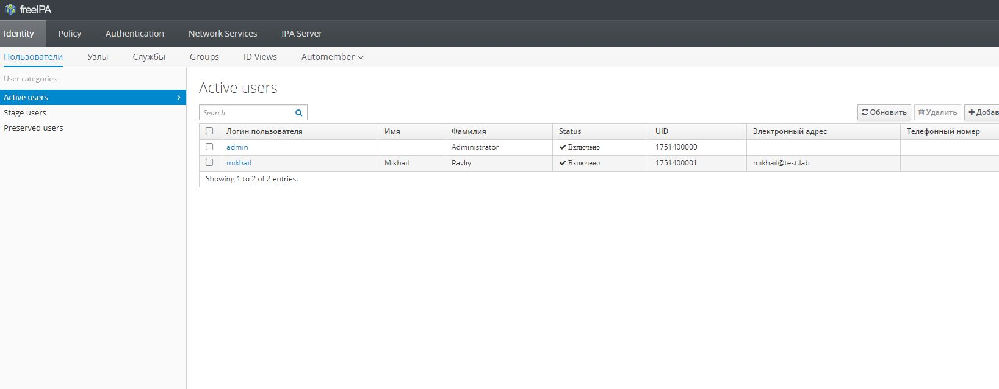

# LDAP
1. Установить FreeIPA;
2. Написать Ansible playbook для конфигурации клиента;
3. \* Настроить аутентификацию по SSH-ключам;
4. ** Firewall должен быть включен на сервере и на клиенте.

Созданы две ansible-роли, которые настраивают хост ```ipaserver``` в качестве FreeIPA сервера и входят в домен ```test.lab``` Также созданы две тестовые станции-  ```test1``` и ```test2```. Так же  создается пользователь ```mikhail```, у котрого есть доступ на тестовые станции в домене с помощью  ssh. Firewall в свою очередь при этом остается включен и на сервере, и на клиентах. Для проверки необходимо выполнить ```vagrant up```. и зайти в web по адресу ```192.168.1.7``` , логин для входа - ```admin```, пароль - ```12qwasZX```

ниже скрины нашего сервера




Проверим аутентификации по SSH-ключу:
```ruby
[vagrant@test1 ~]$ ssh -i ./test_lab_ssh_key mikhail@test2.test.lab
Creating home directory for mikhail.
[mikhail@test2 ~]$ pwd
/home/mikhail
[vagrant@test1 ~]$ ssh -i ./test_lab_ssh_key mikhail@ipaserver.test.lab
Creating home directory for mikhail.
[mikhail@ipaserver ~]$ pwd
/home/mikhail
```

